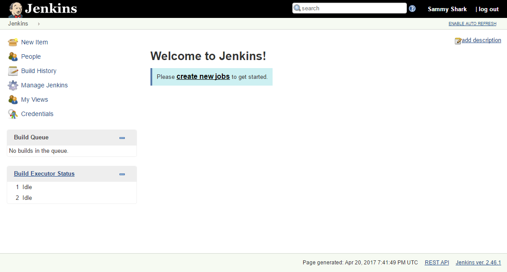

**Created**: 17 July 2017

# Jenkins on Ubuntu 16.04

These instructions are mostly taken from [Digital Ocean's tutorial for setting up Jenkins on Ubuntu 16.04](https://www.digitalocean.com/community/tutorials/how-to-install-jenkins-on-ubuntu-16-04).

Jenkins is an open source automation server intended to automate repetitive technical tasks involved in the continuous integration and delivery of software. Jenkins is Java-based and can be installed from Ubuntu packages or by downloading and running its Web application ARchive (WAR) file — a collection of files that make up a complete web application which is intended to be run on a server.

In this tutorial we will install Jenkins by adding its Debian package repository, then using that repository to install the package using `apt-get`.

# Instructions

## Step 1 — Installing Jenkins

The version of Jenkins included with the default Ubuntu packages is often behind the latest available version from the project itself. In order to take advantage of the latest fixes and features, we'll use the project-maintained packages to install Jenkins.

First, we'll add the repository key to the system.

    $ curl -fsSL https://pkg.jenkins.io/debian/jenkins-ci.org.key | sudo apt-key add -

When the key is added, the system will return `OK`. 

Next, we'll add the Debian package repository address to a separate `jenkins.list` file under `/etc/apt/sources.list.d/`:

    $ echo deb http://pkg.jenkins.io/debian-stable binary/ | sudo tee /etc/apt/sources.list.d/jenkins.list
    
Alternatively, you can add the apt-repository to the default `/etc/apt/sources.list.d/additional-repositories.list` using:

    $ sudo add-apt-repository "deb [arch=amd64] http://pkg.jenkins.io/debian-stable binary/"

Once you've added the PGP key and the package repository, run `apt-get update` to update your package cache:

    $ sudo apt-get update

Finally, we'll install Jenkins and its dependencies, including Java:

    $ sudo apt-get -y install jenkins

Now that Jenkins and its dependencies are in place, we'll start the Jenkins server.

## Step 2 — Starting Jenkins

Using `systemctl` we'll start Jenkins:

    $ sudo systemctl start jenkins

Since systemctl doesn't display output, we'll use its status command to verify that it started successfully:

    $ sudo systemctl status jenkins

If everything went well, the beginning of the output should show that the service is active and configured to start at boot:

    ● jenkins.service - LSB: Start Jenkins at boot time
      Loaded: loaded (/etc/init.d/jenkins; bad; vendor preset: enabled)
      Active:active (exited) since Thu 2017-04-20 16:51:13 UTC; 2min 7s ago
        Docs: man:systemd-sysv-generator(8)

Now that Jenkins is running, we'll adjust our firewall rules so that we can reach Jenkins from a web browser to complete the initial set up.

## (Optional) Step 2a — Opening the Firewall

By default, Jenkins runs on port `8080`, so we'll open that port using ufw:

    $ sudo ufw allow 8080

We can see the new rules by checking UFW's status.

    $ sudo ufw status

We should see that traffic is allowed to port `8080` from anywhere:

    Status: active

    To                         Action      From
    --                         ------      ----
    OpenSSH                    ALLOW       Anywhere
    8080                       ALLOW       Anywhere
    OpenSSH (v6)               ALLOW       Anywhere (v6)
    8080 (v6)                  ALLOW       Anywhere (v6)

Now that Jenkins is installed and the firewall allows us to access it, we can complete the initial setup.

## Step 3 — Setting up Jenkins

To set up our installation, we'll visit Jenkins on its default port, `8080`, using the server domain name or IP address e.g. `localhost`: 

    http://localhost:8080/

We should see "Unlock Jenkins" screen, which displays the location of the initial password:

In the terminal window, we'll use the cat command to display the password:

    sudo cat /var/lib/jenkins/secrets/initialAdminPassword

We'll copy the 32-character alphanumeric password from the terminal and paste it into the "Administrator password" field, then click "Continue". The next screen presents the option of installing suggested plugins or selecting specific plugins.

We'll click the "Install suggested plugins" option, which will immediately begin the installation process:

When the installation is complete, we'll be prompted to set up the first administrative user. It's possible to skip this step and continue as admin using the initial password we used above, but we'll take a moment to create the user.

> **Note:** The default Jenkins server is NOT encrypted, so the data submitted with this form is not protected. When you're ready to use this installation, follow the guide How to Configure Jenkins with SSL using an Nginx Reverse Proxy. This will protect user credentials and information about builds that are transmitted via the Web interface.

Once the first admin user is in place, you should see a "Jenkins is ready!" confirmation screen.

Click "Start using Jenkins" to visit the main Jenkins dashboard:

